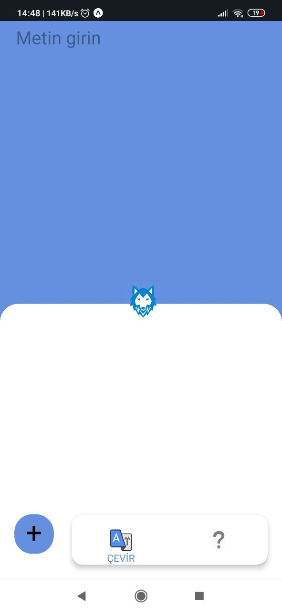
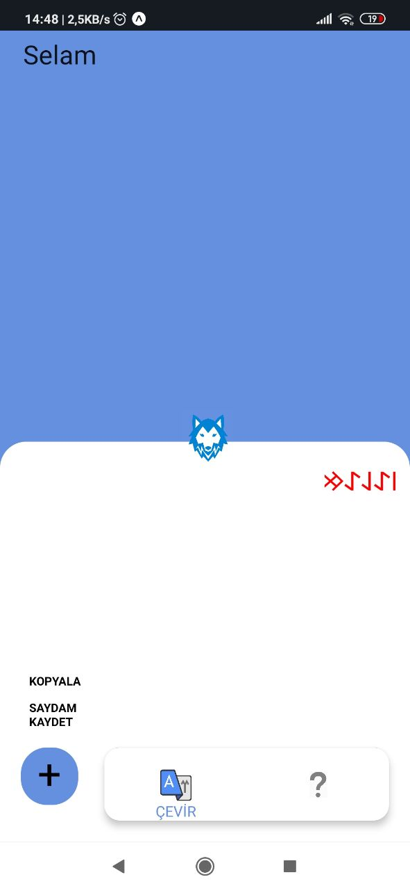
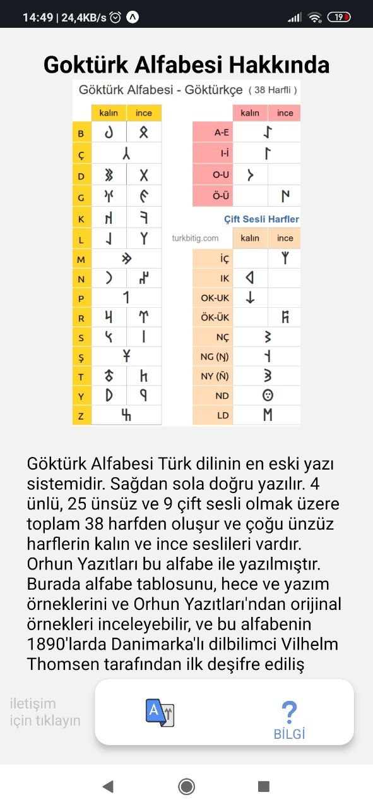

# Translator-App
This Program translates the Latin alphabet to the Turk alphabet (Gokturk alphabet), taking into account features unique to the Turk (Gokturk) alphabet and such as "Büyük Ünlü Uyumu" in Turkish.
-maybe it can be published on google play-
## Video in Demo

## Image in Demo
1

2

3

